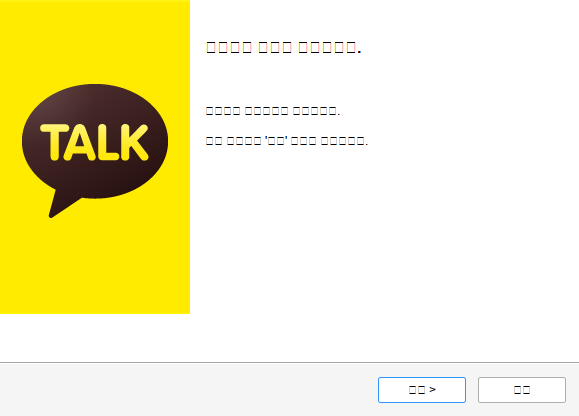
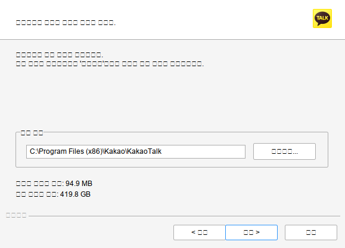
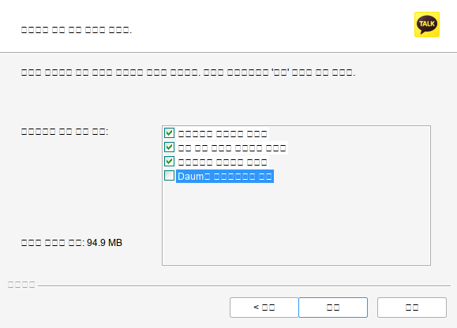
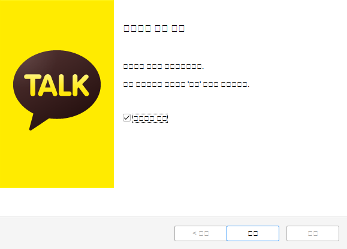
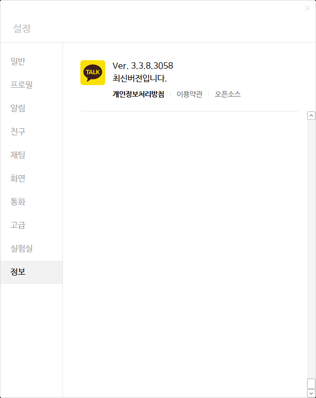

# kakaotalk-env


Configuration Environment for KakaoTalk [1] and its wrapper script to start and quit the Kakao Talk in the Debian / Ubuntu Linux.

## Backgroud

I am weak to type many words with the small phone, and it turns out so many typos in messages. Since Kakao doesn't support the KakaoTalk Desktop for Linux distribution, so I just tried to install it through Wine. This repository was turned out my struggle while doing so. I hope that Kakao should support their application for Linux architecture more and more. I am pretty sure that the company has a lot of benefits from Linux community.

## Preparation (Debian 11)

Note that with the default Debian installation, `${USER}` doesn't belong to `sudo` group. One should add the relevant user account to system `sudo` group.

```bash
usermod -aG sudo ${USER}
```

Of course, one should logout and login in, then be back to this console.

* Install required packages and **Wine 7 stable** (latest) from Winehq repository (Debian package Wine doesn't work with Kakaotalk).


```bash
bash scripts/updateWine4Debian11.bash
```

* Configure Wine first. And choose Window 10. (It doesn't matter actually.)

```bash
winecfg
```

||
| :---: |
|**Figure 1** |

## Setup

```bash
$ make setup
```

*  Make sure you select `한국어` instead of `English` at this step. With Wine 7, it works, but UI is ugly.

||
| :---: |
|**Setup Step 1** |


* Click next or continue `  >`


||
| :---: |
|**Setup Step 2** |


||
| :---: |
|**Setup Step 3** |


* Unselect the checkbox with Daum prefix

||
| :---: |
|**Setup Step 4** |

* Select Middle button (as default). One has to login the Kakao service with an accout.

||
| :---: |
|**Setup Step 5** |

||
| :---: |
|**Setup Step 6** |

||
| :---: |
|**Setup Step 7** |

* One should go `화면` option, the sixth from top to bottom, in the left broken menu. The first and second options in the right panel are shown in the following picture.
Please select the second one as Naum font. Then the application will ask us to reboot. After rebooting one can see the Korean font well.

||
| :---: |
|**Setup Step 8** |

* Version

||
| :---: |
|**Setup Step 9** |


### `make get`

Download `KakaoTalk_Setup.exe` from [2].

### `make conf`

This rule make the basic Korean font setup for KakaoTalk by editing `$HOME/.wine/system.reg`. The default font I've tested is `NanumGothic`. If one would like to test other fonts, please check `DEFAULT_FONT` in `configure/CONFIG` file.

### `make conf.show`

This rule shows what two defintions are in `$HOME/.wine/system.reg`.

```bash
$ make conf.show
 88261  "MS Shell Dlg"="NanumGothic"
 88262  "MS Shell Dlg 2"="NanumGothic"
```

### `make install`

Install KakaoTalk.

* Login with Kakao account

With the `kakaotalk.bash`, one can register this application with the Kakao-Talk.  And it may start and kill few times.

### `make uninstall`

Uninstall the installed Kakaotalk through `kakaotalk.bash`.

## Upgrade

The automatic update doesn't work. However, we can install it again from scratch. If there is a running KakaoTalk, this rule will stop it.

```bash
make upgrade
```

If one has the exist `KakaoTalk_Setup.exe` file locally, the rule triggers an additional rule `make backup`. This backup rule renames the exist installation file with an extracted version number suffix, for example, `KakaoTalk_Setup.exe_v3.1.6.2572`. If the same version file exists, it will overwrite it. In case, the latest version doesn't work, use this backup file to recover it.

## Command line Commands

Usually, `Mate Desktop` one can find the Kakao icon in `Applicatons / Wine / Programs / Kakao Talk. However, sometime, the command line is useful.

* Start it

```bash
bash kakaotalk.bash start

or

make start
```

* Stop it

```bash
bash kakaotalk.bash stop

or

make stop
```

## Ubuntu 20.04

* There is no `NanumGothic`, but one can select `NanumBarunGothic` in setting of KakaoTalk.

||
| :---: |
|**Figure 11** Kakao Talk Setting. |

* ufw is the default active stage, but disable. I tested with both disable and enable (with gufw) with the default ufw firewald configuration. Both case work fine.

## Doesn't work

In case, this repository doesn't work for anyone. One may try the method with PlayOnLinux shown in https://github.com/kimlulz/Katalk_linux.

## More Screenshots

||
| :---: |
|**Figure 12** Kakao Talk Setting. |

||
| :---: |
|**Figure 13** Kakao Talk Setting Information. |

||
| :---: |
|**Figure 14** Kakao Talk and Debian System Information. |

## Korean Input System

I don't use the Korean Locale, because it makes me so many troubles to build programs since my First SUSE / Redhat Linux. Now it is much better than before. But I don't need to use them also. I delightly use `ibus-hangul`, it is easy to setup, and work very well [3]. Here is my locale information if anyone have some difficulties.

```bash
LANG=en_US.UTF-8
LANGUAGE=
LC_CTYPE=en_US.UTF-8
LC_NUMERIC="en_US.UTF-8"
LC_TIME="en_US.UTF-8"
LC_COLLATE="en_US.UTF-8"
LC_MONETARY="en_US.UTF-8"
LC_MESSAGES="en_US.UTF-8"
LC_PAPER="en_US.UTF-8"
LC_NAME="en_US.UTF-8"
LC_ADDRESS="en_US.UTF-8"
LC_TELEPHONE="en_US.UTF-8"
LC_MEASUREMENT="en_US.UTF-8"
LC_IDENTIFICATION="en_US.UTF-8"
LC_ALL=
```

## Errors and Warnings

* With the latest KakaoTalk, I saw an issue on Debian 10. If one cannot run the KakaoTalk, please see [docs/Debian10.md](docs/Debian10.md).

## References

[1] <https://www.kakaocorp.com/service/KakaoTalk?lang=en>

[2] <https://downloadkakaotalk.com/kakao-talk-for-windows.html>

[3] <https://github.com/libhangul/ibus-hangul>
