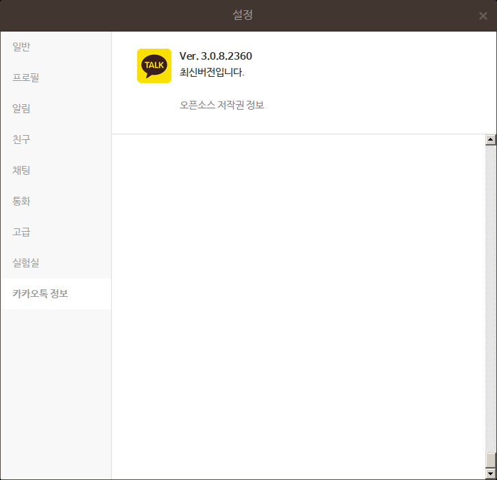

# kakaotalk-env

Configuration Environment for KakaoTalk [1] and its wrapper script to start and quit the Kakao Talk in the Debian Linux.


## Assumption

A system must have **one** single wine application for the Kakao Talk. If not, please don't use this repo to handle the Kakao Talk. This script will kill own entire wine applications when the Kakao Talk will be restarted or stopped.

## Preparation

* Install Wine with root

```bash
dpkg --add-architecture i386 && apt-get update && apt-get install wine wine32 winbind
```

or

```bash
make pkgs
```

## Build

```bash
$ make get
........
KakaoTalk_Setup.exe        100%[==================>]  52.46M  17.0MB/s    in 3.7s
2020-08-08 22:39:49 (14.3 MB/s) - ‘KakaoTalk_Setup.exe’ saved [55013760/55013760]

$ make conf
>>> Updating /home/jhlee/.wine/system.reg with NanumGothic

$ make install

```

### Follow Screenshots

||
| :---: |
|**Figure 1** |

||
| :---: |
|**Figure 1** |

||
| :---: |
|**Figure 2** |

||
| :---: |
|**Figure 3** |

||
| :---: |
|**Figure 4** |

||
| :---: |
|**Figure 5** |

||
| :---: |
|**Figure 6** One can see the Setting icon in the left-bottom area. The broken menu order is 설정, 잠금모드, 로그아웃, 종료. |

||
| :---: |
|**Figure 7** Font Selection Menu. |

||
| :---: |
|**Figure 8** |

||
| :---: |
|**Figure 9** After restarting it, the Korean fonts are shown clearly.|

### `make get`

Download `KakaoTalk_Setup.exe` from [2].

### `make conf`

This rule make the basic Korean font setup for KakaoTalk by editing `$HOME/.wine/system.reg`. The default font I've tested is `NanumGothic`. If one would like to test other fonts, please check `DEFAULT_FONT` in `configure/CONFIG` file.

### `make conf.show`

This rule shows what two defintions are in `$HOME/.wine/system.reg`.

```bash
$ make conf.show
 88261  "MS Shell Dlg"="NanumGothic"
 88262  "MS Shell Dlg 2"="NanumGothic"
```

### `make install`

Install KakaoTalk.

* Login with Kakao account

With the `kakaotalk.bash`, one can register this application with the Kakao-Talk.  And it may start and kill few times.

## Upgrade

The automatic update doesn't work. However, we can install it again from scratch. It will have the latest version.

```bash
make upgrade
```

## Command line Commands

Usually, `Mate Desktop` one can find the Kakao icon in `Applicatons / Wine / Programs / Kakao Talk. However, sometime, the command line is useful.

* Start it

```bash
bash kakaotalk.bash start
```

* Stop it

```bash
bash kakaotalk.bash stop
```

## Screenshots

||
| :---: |
|**Figure 10** Kakao Talk Setting. |

||
| :---: |
|**Figure 11** Kakao Talk Setting Information. |

||
| :---: |
|**Figure 12** Kakao Talk and Debian System Information. |

## References

[1] <https://www.kakaocorp.com/service/KakaoTalk?lang=en>

[2] <https://downloadkakaotalk.com/kakao-talk-for-windows.html>
