# kakaotalk-env


Configuration Environment for KakaoTalk [1] and its wrapper script to start and quit the Kakao Talk in the Debian / Ubuntu Linux.

## Backgroud

I am weak to type many words with the small phone, and it turns out so many typos in messages. Since Kakao doesn't support the KakaoTalk Desktop for Linux distribution, so I just tried to install it through Wine. This repository was turned out my struggle while doing so. I hope that Kakao should support their application for Linux architecture more and more. I am pretty sure that the company has a lot of benefits from Linux community.

## Preparation

* Install Wine with root

```bash
dpkg --add-architecture i386 && apt-get update && apt-get install wine wine32 winbind fonts-nanum fonts-nanum-coding fonts-nanum-eco fonts-nanum-extra make
```

or

If one has already `make`, one can use the following commands

```bash
make pkgs
```

Note that with the default Debian installation, `${USER}` doesn't belong to `sudo` group. One should add the relevant user account to system `sudo` group.

```bash
usermod -aG sudo ${USER}
```

Of course, one should logout and login in, then be back to this console.

* Configure Wine first. And choose Window 10. (It doesn't matter actually.)

```bash
winecfg
```

## Build

```bash
$ make get
........
KakaoTalk_Setup.exe        100%[==================>]  52.46M  17.0MB/s    in 3.7s
2020-08-08 22:39:49 (14.3 MB/s) - ‘KakaoTalk_Setup.exe’ saved [55013760/55013760]

$ make conf
>>> Updating /home/jhlee/.wine/system.reg with NanumGothic

$ make install
```

One should see the following screenshots for further configuration.

### Follow Screenshots

|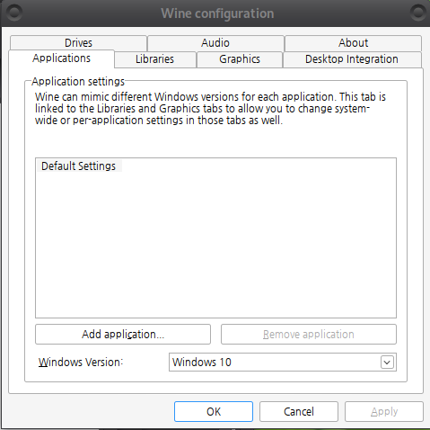|
| :---: |
|**Figure 0.0** |

|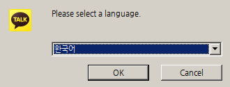|
| :---: |
|**Figure 0.1** |

|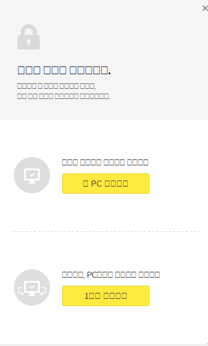|
| :---: |
|**Figure 0.2** |

|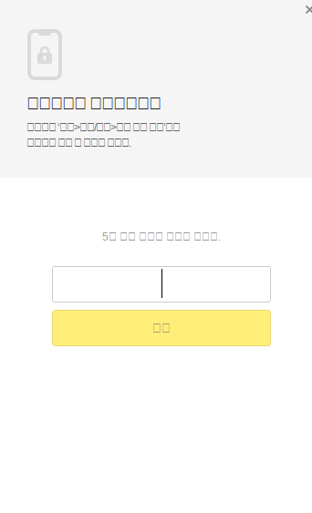|
| :---: |
|**Figure 0.3** |

|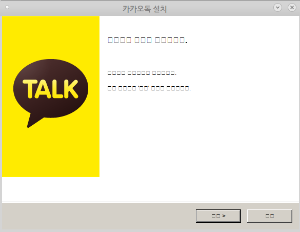|
| :---: |
|**Figure 1** |

||
| :---: |
|**Figure 1** |

|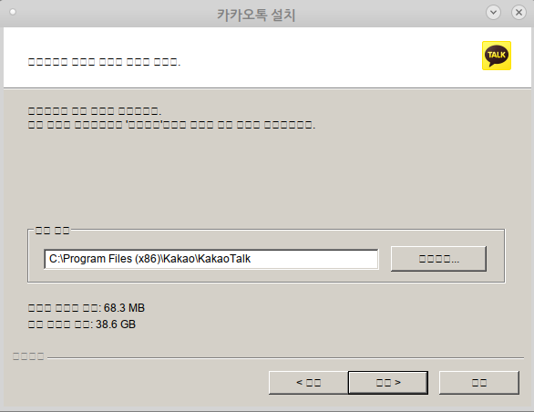|
| :---: |
|**Figure 2** |

|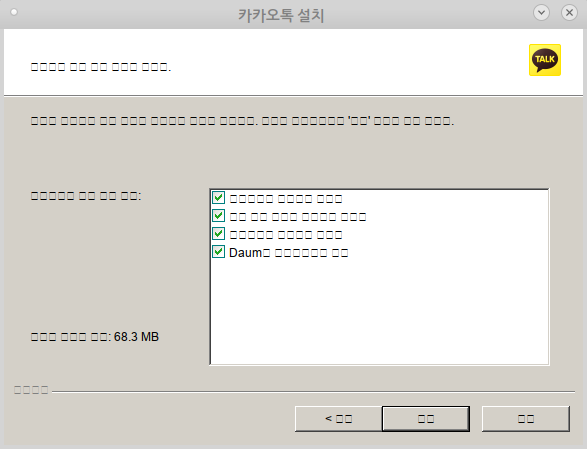|
| :---: |
|**Figure 3** |

|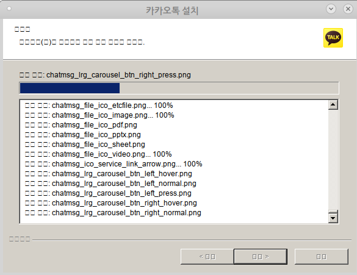|
| :---: |
|**Figure 4** |

|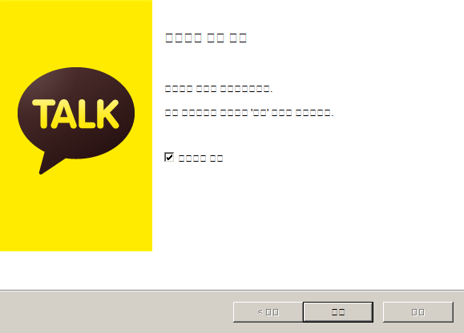|
| :---: |
|**Figure 5** |

||
| :---: |
|**Figure 6** One can see the Setting icon in the left-bottom area. The broken menu order is 설정, 잠금모드, 로그아웃, 종료. |

|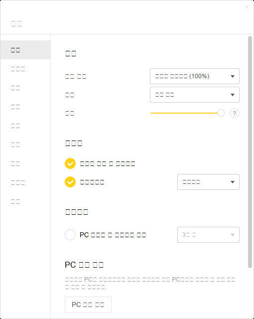|
| :---: |
|**Figure 7** Font Selection Menu. |

|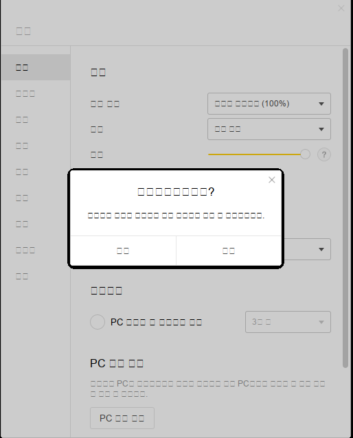|
| :---: |
|**Figure 8** |

|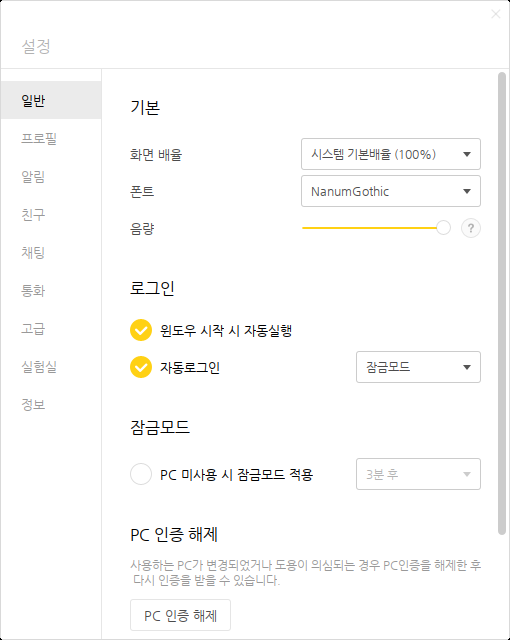|
| :---: |
|**Figure 9** After restarting it, the Korean fonts are shown clearly.|

### `make get`

Download `KakaoTalk_Setup.exe` from [2].

### `make conf`

This rule make the basic Korean font setup for KakaoTalk by editing `$HOME/.wine/system.reg`. The default font I've tested is `NanumGothic`. If one would like to test other fonts, please check `DEFAULT_FONT` in `configure/CONFIG` file.

### `make conf.show`

This rule shows what two defintions are in `$HOME/.wine/system.reg`.

```bash
$ make conf.show
 88261  "MS Shell Dlg"="NanumGothic"
 88262  "MS Shell Dlg 2"="NanumGothic"
```

### `make install`

Install KakaoTalk.

* Login with Kakao account

With the `kakaotalk.bash`, one can register this application with the Kakao-Talk.  And it may start and kill few times.

## Upgrade

The automatic update doesn't work. However, we can install it again from scratch. If there is a running KakaoTalk, this rule will stop it.

```bash
make upgrade
```

## Command line Commands

Usually, `Mate Desktop` one can find the Kakao icon in `Applicatons / Wine / Programs / Kakao Talk. However, sometime, the command line is useful.

* Start it

```bash
bash kakaotalk.bash start

or

make start
```

* Stop it

```bash
bash kakaotalk.bash stop

or

make stop
```

## Ubuntu 20.04

* There is no `NanumGothic`, but one can select `NanumBarunGothic` in setting of KakaoTalk.

|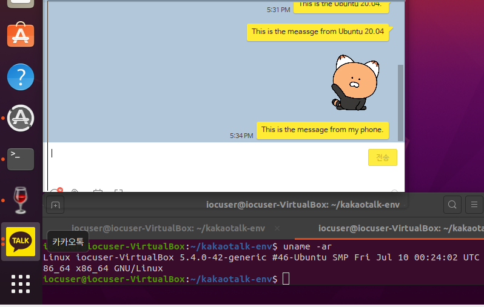|
| :---: |
|**Figure 11** Kakao Talk Setting. |

* ufw is the default active stage, but disable. I tested with both disable and enable (with gufw) with the default ufw firewald configuration. Both case work fine.

## More Screenshots

|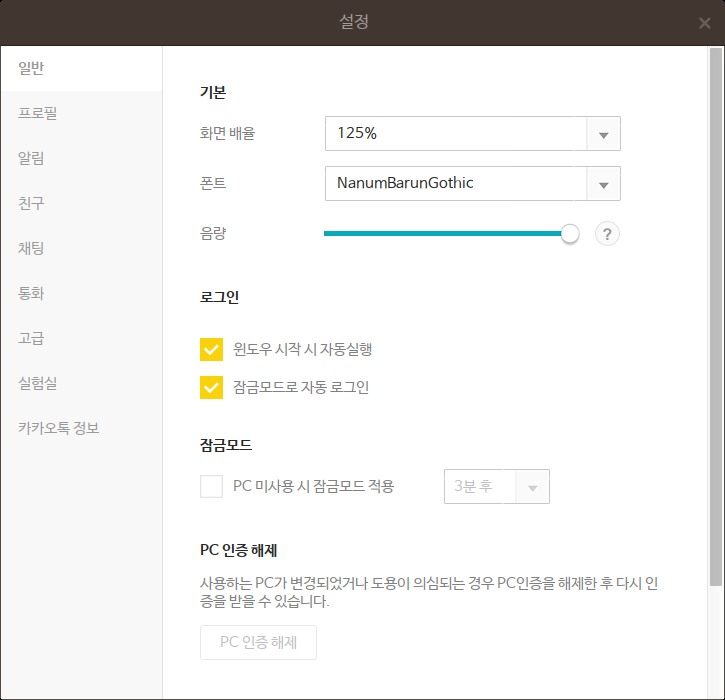|
| :---: |
|**Figure 12** Kakao Talk Setting. |

||
| :---: |
|**Figure 13** Kakao Talk Setting Information. |

||
| :---: |
|**Figure 14** Kakao Talk and Debian System Information. |

## Korean Input System

I don't use the Korean Locale, because it makes me so many troubles to build programs since my First SUSE / Redhat Linux. Now it is much better than before. But I don't need to use them also. I delightly use `ibus-hangul`, it is easy to setup, and work very well [3]. Here is my locale information if anyone have some difficulties.

```bash
LANG=en_US.UTF-8
LANGUAGE=
LC_CTYPE=en_US.UTF-8
LC_NUMERIC="en_US.UTF-8"
LC_TIME="en_US.UTF-8"
LC_COLLATE="en_US.UTF-8"
LC_MONETARY="en_US.UTF-8"
LC_MESSAGES="en_US.UTF-8"
LC_PAPER="en_US.UTF-8"
LC_NAME="en_US.UTF-8"
LC_ADDRESS="en_US.UTF-8"
LC_TELEPHONE="en_US.UTF-8"
LC_MEASUREMENT="en_US.UTF-8"
LC_IDENTIFICATION="en_US.UTF-8"
LC_ALL=
```

## References

[1] <https://www.kakaocorp.com/service/KakaoTalk?lang=en>

[2] <https://downloadkakaotalk.com/kakao-talk-for-windows.html>

[3] <https://github.com/libhangul/ibus-hangul>
