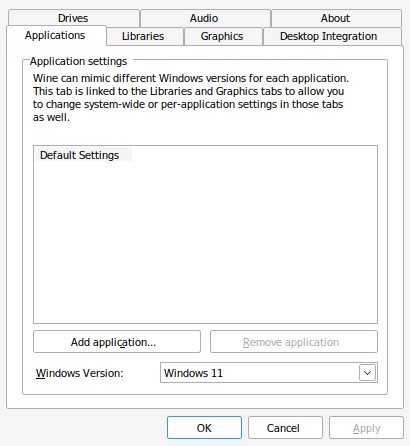
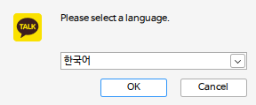
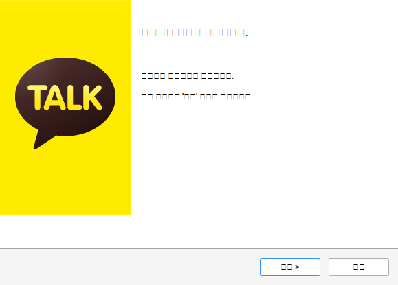
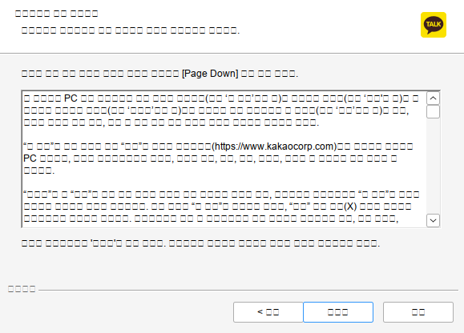
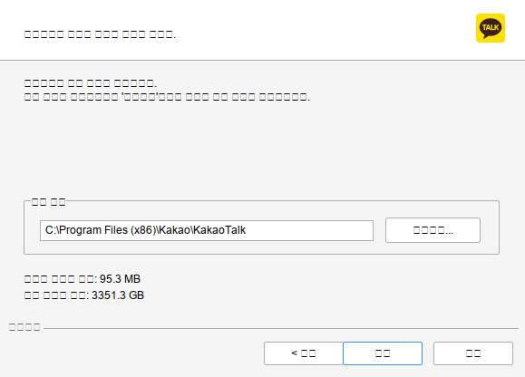
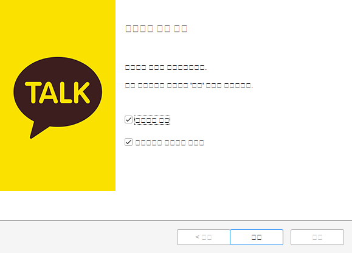
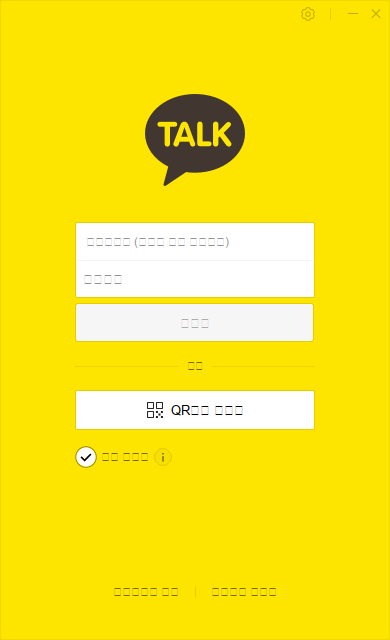
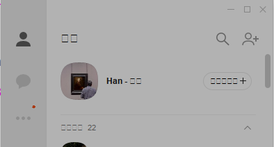
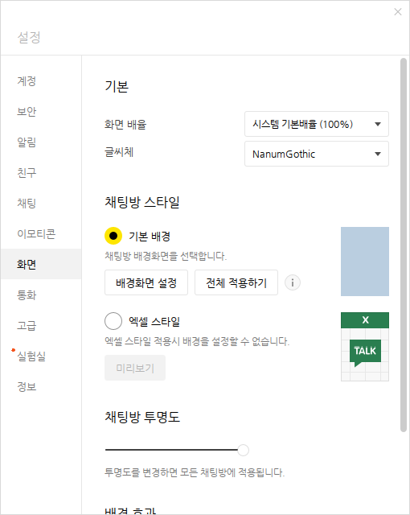
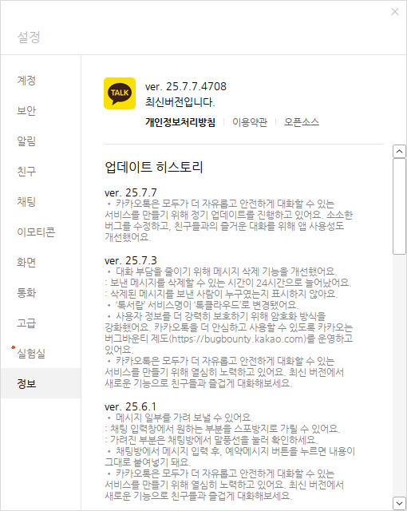

# kakaotalk-env

[](https://github.com/jeonghanlee/kakaotalk-env/actions/workflows/linter.yml)

KakaoTalk Wine setup environment for Debian and Ubuntu Linux.

* Architecture: [docs/ARCHITECTURE.md](docs/ARCHITECTURE.md)
* CLI Reference: [docs/KAKAOTALK_CLI.md](docs/KAKAOTALK_CLI.md)
* Debian 10 compatibility note: [docs/Debian10.md](docs/Debian10.md)
* Wine setup helper: `scripts/UpdateWine4Debian.bash`

## Prerequisites

The user account must be able to run `sudo`. On a default Debian installation, add the account to the `sudo` group from a privileged shell:

```bash
usermod -aG sudo ${USER}
```

Log out and log back in before continuing.

Install Wine and the required font packages:

```bash
bash scripts/UpdateWine4Debian.bash
```

Configure Wine before installing KakaoTalk:

```bash
winecfg
```

Select a Windows version in the Wine configuration dialog. Windows 11 is acceptable for current Wine releases.

|  |
| :---: |
| Wine configuration |

## Makefile Workflow

Show available targets:

```bash
make help
```

Install or reinstall KakaoTalk:

```bash
make setup
```

The setup workflow downloads the installer, updates the Wine shell font mapping, shows the configured font entries, stops any running KakaoTalk process, and starts the installer through Wine.

Upgrade or reinstall from the latest downloaded installer:

```bash
make upgrade
```

If `KakaoTalk_Setup.exe` already exists, `make backup` extracts the installer changelog and renames the existing file with a version suffix before downloading a new copy.

Set the Wine shell fonts:

```bash
make conf
```

Show the configured Wine shell font entries:

```bash
make conf.show
```

The default font is `NanumBarunGothic`. Override it without editing tracked files by creating `configure/CONFIG_SITE.local`:

```makefile
DEFAULT_FONT := NanumBarunGothic
```

## Direct CLI Workflow

Start KakaoTalk:

```bash
bash kakaotalk.bash start
```

Stop KakaoTalk:

```bash
bash kakaotalk.bash stop
```

Restart KakaoTalk:

```bash
bash kakaotalk.bash restart
```

Uninstall KakaoTalk:

```bash
bash kakaotalk.bash uninstall
```

Print the local outbound IPv4 address:

```bash
bash kakaotalk.bash ip
```

## Setup Screens

During installation, select `한국어` in the installer language prompt.

|  |
| :---: |
| Setup step 1 |

|  |
| :---: |
| Setup step 2 |

|  |
| :---: |
| Setup step 2.1 |

|  |
| :---: |
| Setup step 3 |

|  |
| :---: |
| Setup step 4 |

|  |
| :---: |
| Setup step 5 |

Use QR code login.

|  |
| :---: |
| Setup step 6 |

Select `Nanum Gothic` in KakaoTalk settings, then restart KakaoTalk.

|  |
| :---: |
| Setup step 7 |

|  |
| :---: |
| Setup step 8 |

## Korean Input System

`ibus-hangul` works well with an English UTF-8 locale. A typical locale setup is:

```bash
LANG=en_US.UTF-8
LANGUAGE=
LC_CTYPE=en_US.UTF-8
LC_NUMERIC="en_US.UTF-8"
LC_TIME="en_US.UTF-8"
LC_COLLATE="en_US.UTF-8"
LC_MONETARY="en_US.UTF-8"
LC_MESSAGES="en_US.UTF-8"
LC_PAPER="en_US.UTF-8"
LC_NAME="en_US.UTF-8"
LC_ADDRESS="en_US.UTF-8"
LC_TELEPHONE="en_US.UTF-8"
LC_MEASUREMENT="en_US.UTF-8"
LC_IDENTIFICATION="en_US.UTF-8"
LC_ALL=
```

## References

* KakaoTalk: <https://www.kakaocorp.com/service/KakaoTalk?lang=en>
* KakaoTalk Windows installer: <https://downloadkakaotalk.com/kakao-talk-for-windows.html>
* ibus-hangul: <https://github.com/libhangul/ibus-hangul>
