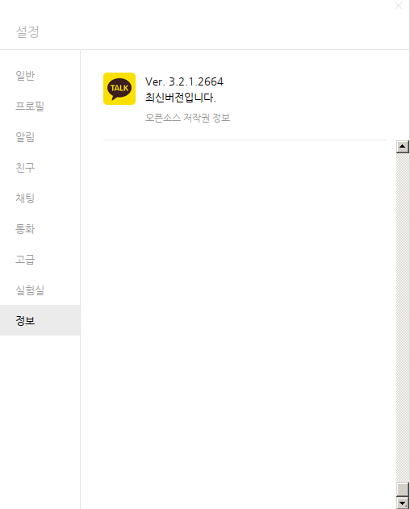

# Debian 10

From KakaoTalk PC Version 3.1.7.2601, the default Debian wine returns the followin error message:

```bash
err:module:LdrInitializeThunk "Vox.dll" failed to initialize, aborting
```

And KaKaoTalk uses 100\% CPU and is not going to open its UI. In this case, one should use the wine development branch instead of the stable from the Winehq not from Debian official. Note that one should use *su* accout or a relaveant sudo account. The full instruction can be found at <https://wiki.winehq.org/Debian>.

```bash
wget -nc https://dl.winehq.org/wine-builds/winehq.key
apt-key add winehq.key
echo "deb https://dl.winehq.org/wine-builds/debian/ buster main" > /etc/apt/sources.list.d/winehq.list
apt update
apt install --install-recommends winehq-devel
```

After the above procedures, one can upgrade or reinstall it through

```bash
make upgrade
```

The wine version can be checked through

```bash
$ wine --version
wine-6.0-rc6
```

And *Figure Docs.1 shows the latest (Jan 16, 2021) KakaoTalk about page.

||
| :---: |
|**Figure Docs.1** |
